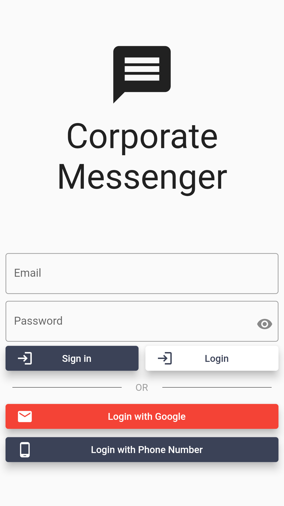
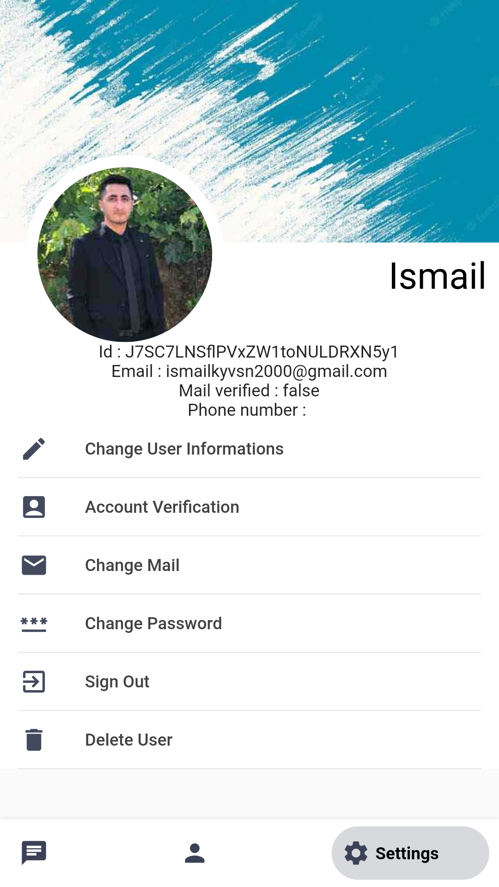
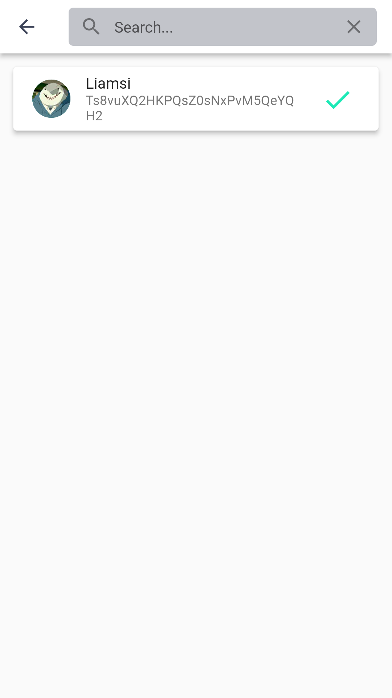
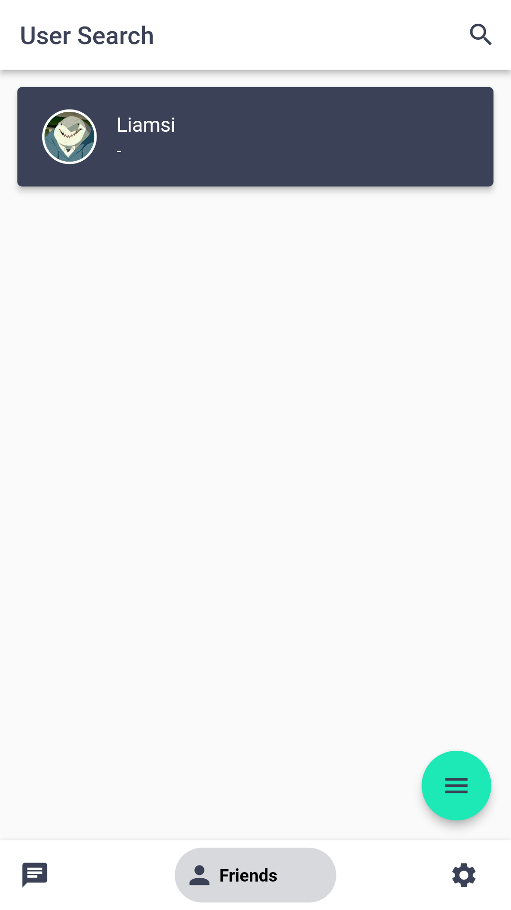
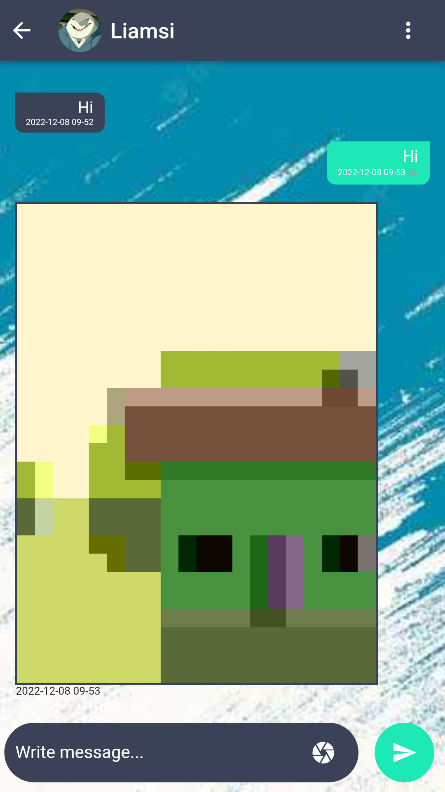
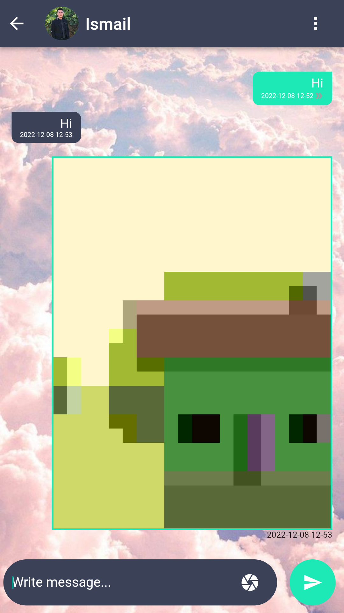
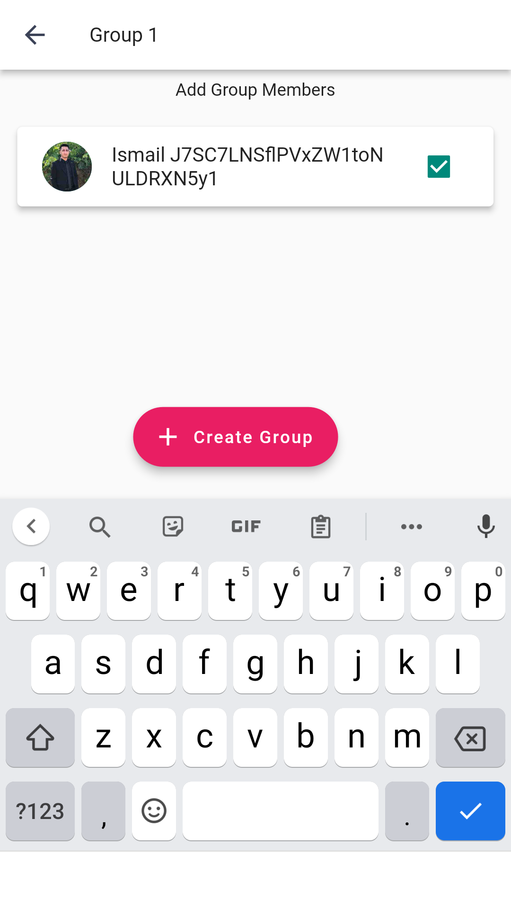
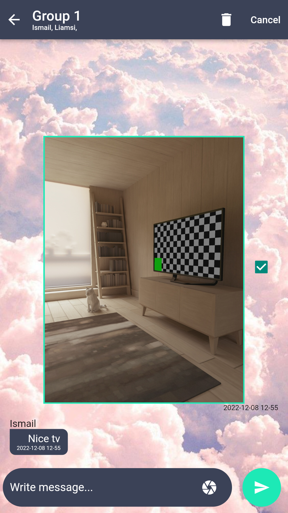

# CORPORATE MESSANGER
A messaging application that allows you to message other people in the application, set up groups and customize your profile.

> Frebase Realtime Databese, Storage, Authentication

# Login Page
- [x] Login with Email
- [x] Login with Google
- [x] Login with Phone Number

  

# Settings Page
- [x] Customize Profile Picture
- [x] Customize Background Picture
- [x] Change User Informations
- [x] Change Mail (if u logged with email)
- [x] Change Password (if u logged with email)
- [x] Sign Out
- [x] Delete Account and All Messages (from other users to)

  

# Message Page
- [x] Search by Username
- [x] Add Other Users as Friend
- [x] Chat with Them

 
 

# Personal Chat Page
- [x] Send Text Messages
- [x] Send Imgaes from Camera and Gallery
- [x] Press and Hold Messages to Delete (also deletes from your friend)
- [x] Click Image to Zoom In

  
 

# Group Chat Page
- [x] Create a Group with Your Friends
- [x] Same Chat Features with Personal Chat Pgae 
- [x] Add a Friend to Group After Creating Group
- [x] Leave Group

  
 

